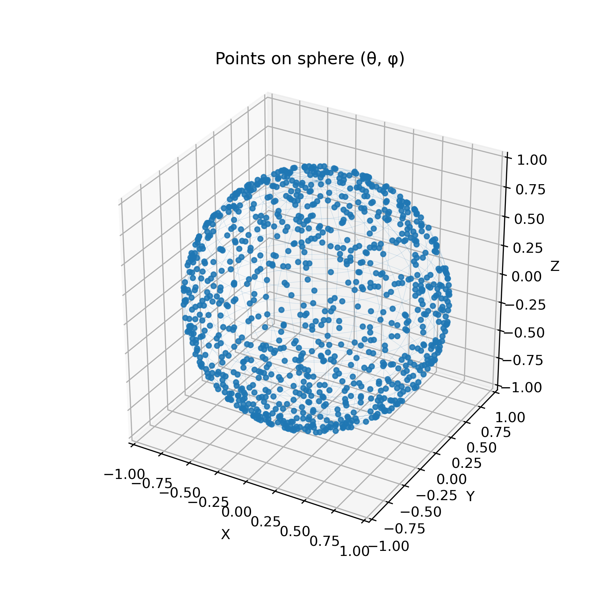
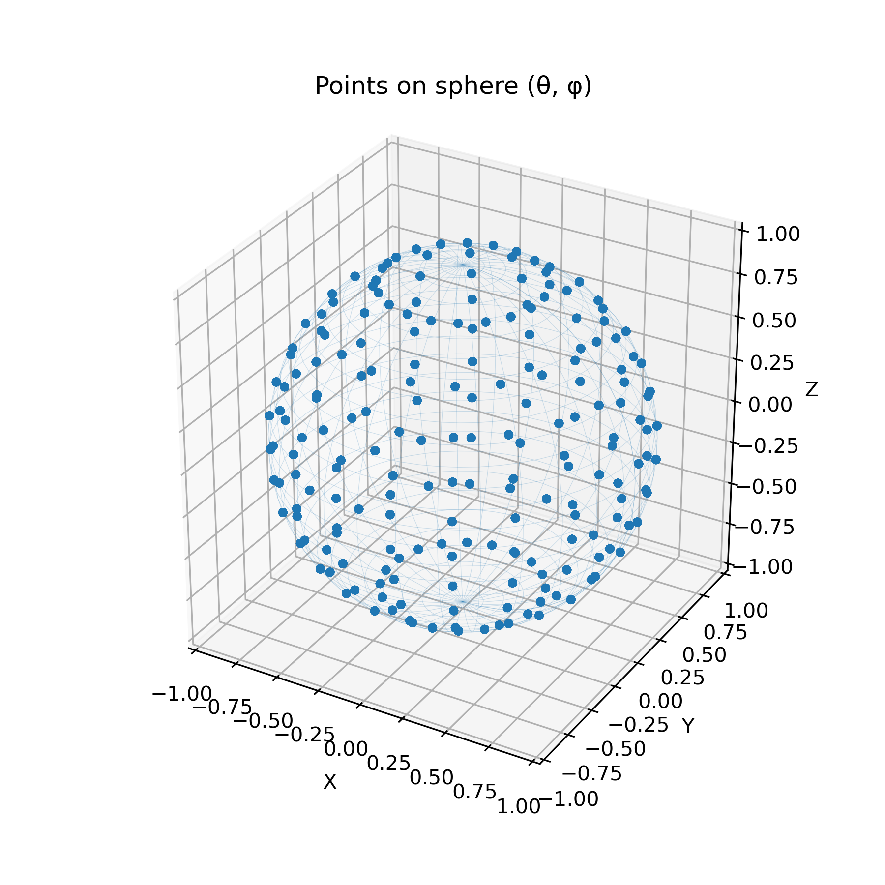
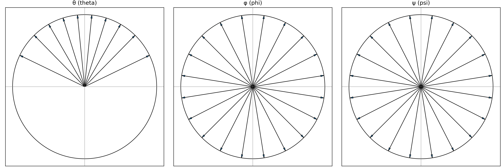
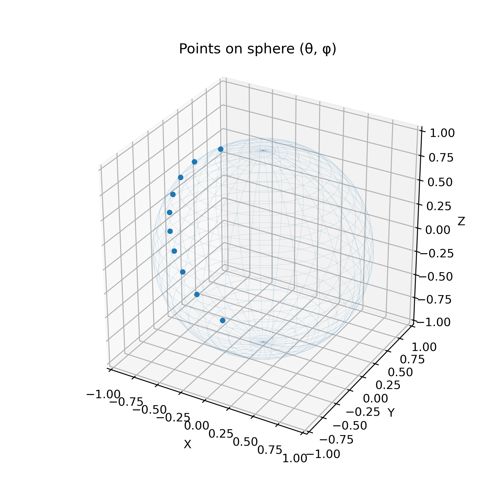
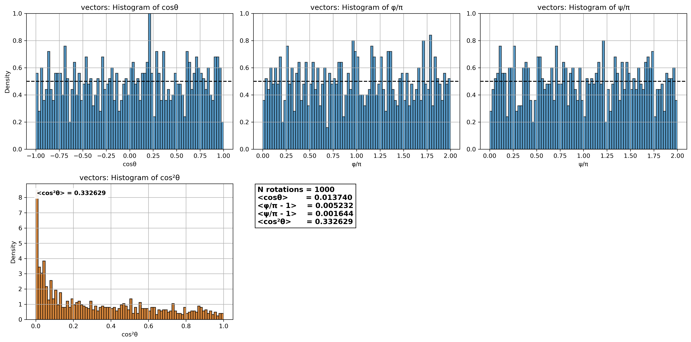

# rotate_adsorbate.py

A Python tool to generate rotated configurations of a molecule or protein using Euler angles (ZYZ convention).  
It supports both grid-based and random sampling and saves the rotated coordinates along with the corresponding angles.  
This tool is useful for molecular simulations, protein orientation studies, and sampling in 3D rotational space.

## Requirements

- Python 3.8+  
- Dependencies:
  - `math` (standard library)  
  - `numpy`  
  - `scipy` (specifically `scipy.spatial.transform.Rotation`)  
  - `matplotlib`  
  - `argparse` (standard library)  
  - `sys` (standard library)  
  - `os` (standard library)  

## Inputs and Outputs

### Inputs
- **XYZ file**: molecular structure to be rotated (typically coarse-grained).  
- **Mode selection**:  
  - `grid` → sampling using midpoints (open intervals)  
  - `grid_2` → sampling including endpoints
  - `random` → Haar-like random sampling  
- **Optional parameters**: number of divisions (`nθ`, `nφ`, `nψ`) or total number of rotations (`nrot`).

### Outputs
- **Files**:  
  - Rotated coordinates saved as an **XYZ trajectory**.  
  - `data.dat` containing the Euler angles ($\theta$, $\phi$, $\psi$) used.  

- **Figures** (generated automatically):  
  - Angle distributions ($\theta$, $\phi$, $\psi$).  
  - Sampling preview of orientations on the unit sphere.  

## Uniform sampling of 3D rotations

Here, we justify the range of the angle in order to sample rotation of protein.

The rotation of a protein (or any molecule) can be expressed as the orientation of a unit vector $\hat r$.  
In spherical coordinates, this vector is defined by the polar angle $\theta$ and the azimuthal angle $\phi$ so:

$$
\hat r = \left(\sin\theta \cos\phi , \sin\theta \sin\phi , \cos\theta \right) ;
\qquad 0 \leq \theta \leq \pi , 0 \leq \phi < 2\pi
$$

The corresponding surface element on the unit sphere is:

$$
dS = \sin\theta d\theta d\phi
$$

Integrating this surface element over the full ranges of $\theta$ and $\phi$ covers the entire sphere, which corresponds to sampling all possible orientations:

$$
S = \int_{0}^{\pi} \int_{0}^{2\pi} \sin\theta d\theta d\phi
$$

Using the relationship $-d\left( \cos\theta \right) = \sin\theta d\theta$ and inverting the range of integration (from $\pi$ to $0$), we obtain the following expression:

$$
S = \int_{-1}^{1} \int_{0}^{2\pi} d\left(\cos\theta\right) d\phi
$$

This formulation shows that uniform sampling in $\cos\theta$ and $\phi$ is required to generate an unbiased distribution of orientations.  
To account for rotations around $\hat r$, a third angle $\psi$ is introduced with range $0 \leq \psi < 2\pi$.

Thus, a random orientation in 3D is obtained by sampling:

$$
\begin{aligned}
\cos \theta &\in [-1, 1] \\
\phi &\in [0, 2\pi) \\
\psi &\in [0, 2\pi)
\end{aligned}
$$

## Quick start

Run the script:

`python3 rotate_adsorbate.py`

The script will ask for:
- protein name: $\textit{e.g.}$ protein.xyz  (coarce-grained of a protein in this version)
- mode: $\textit{e.g.}$ `random` or `grid` (more models can be seted)
- `nrot` for random or (`nθ`, `nφ`, `nψ`) for grid

## Examples results (random and grid)

Figure 1 illustrates the possible outputs of the script. **Panel A** shows the distribution of orientations obtained by random sampling with $n_{\text{rot}} = 1000$. Each dot corresponds to a direction on the unit sphere, defined by the polar angle $\theta$ and the azimuthal angle $\phi$. The third Euler angle, $\psi$, follows a distribution analogous to $\phi$. The uniform spread of points across the sphere confirms isotropic sampling of orientations.

  
  

Figure 1. Sampling of rotation on the unit sphere using two schemes: (A) random sampling with $n_{\text{rot}} = 1000$, and (B) grid sampling with $n_{\text{rot}} = 4000$ ($n_{\theta}$ = 10, $n_{psi}$ = 20, $n_{\psi}$ = 20).

On the other hand, panel B shows the distribution obtained with grid sampling, using $n_{\theta} = 20$, $n_{\phi} = 10$, and $n_{\psi} = 10$.
The resulting points are uniformly distributed over the surface of the sphere.

On the other hand, the script plot the angles in 2D plot, in order to visualize the extension and distribution of the three applied angles.
The example is shows in grid sampling with with $n_{\theta}$ = 20, $n_{\phi}$ = 10, and $n_{\psi}$ = 10.

**Figure 2.** Employed angled to rotate the protein for a grid sampling with $n_{\text{rot}} = 4000$ ($n_{\theta}$ = 10, $n_{psi}$ = 20, $n_{\psi}$ = 20).

It shoud be noted here, that the a random samplign cover a wide range of angles than grid, however a grid sampling offer a uniform sampling,

## Examples results (grid)

If the system exhibits symmetry around one of the axes, the number of angles to sample can be reduced.  
For example, if the system is symmetric in the *xy*-plane, it is not necessary to include rotations around the $\phi$ angle.  
The following figure illustrates this case.

**Figure 3.** Grid sampling with $n_{\text{rot}} = 4000$ ($n_{\theta} = 10$, $n_{\phi} = 1$, $n_{\psi} = 20$).

## Optional

Additionally, using the script `plot_histo_v6.py` applied to the rotated protein file,  
we can calculate $n_{\theta}$, $n_{\phi}$, and $n_{\psi}$ for each generated configuration.  
The figure below shows the distribution of these angle values in a histogram representation.

**Figure 4.** Calculated angles from rotate protein.

This representation helps determine the sufficient number of rotations required for the system under investigation.  
Ideally, the distribution should be close to 0.5 for each configuration.

