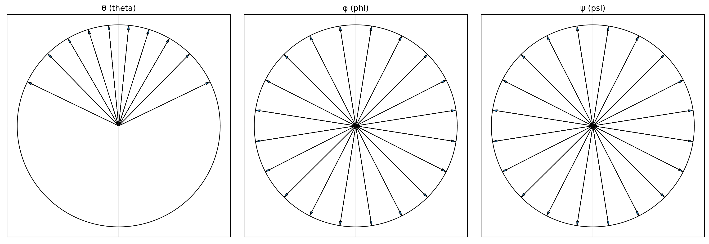
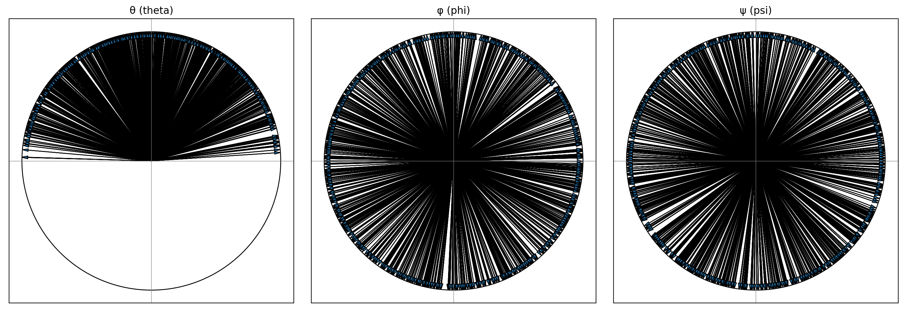

  
  

# rotate_adsorbate.py

Genera configuraciones rotadas de una molécula/proteína usando ángulos de Euler (convención **ZYZ**).  
Soporta muestreos por grilla o aleatorios y guarda tanto las coordenadas como los ángulos usados.

---

## Requisitos

- Python 3.8+
- `numpy`, `scipy`, `matplotlib`

## Results

- **Modes**: `grid` (midpoints), `grid_2` (endpoints), `random` (Haar-like)
- **Outputs**: XYZ trajectory with rotated coordinates + `data.dat` (θ, φ, ψ)
- **Figures**: angle distributions and sampling preview on the unit sphere

## Uniform sampling of 3D rotations

The rotation of a protein can be represented as the orientation of a unit vector $\hat r$ on the unit sphere ($R = 1$).  
In spherical coordinates:

$$
\hat r = (\sin\theta\cos\phi,\; \sin\theta\sin\phi,\; \cos\theta),
\quad 0 \leq \theta \leq \pi,\; 0 \leq \phi < 2\pi.
$$

The corresponding surface element is:

$$
dS = \sin\theta \, d\theta \, d\phi.
$$

Integrating over the entire surface:

$$
S = \int_{0}^{\pi} \int_{0}^{2\pi} \sin\theta \, d\theta \, d\phi.
$$

With substitution $u = \cos\theta$:

$$
S = \int_{-1}^{1} \int_{0}^{2\pi} du \, d\phi.
$$

This shows that uniform sampling in $\cos\theta$ and $\phi$ is required to generate an unbiased distribution of orientations.  
To account for rotations around $\hat r$, a third angle $\psi$ is introduced with range $0 \leq \psi < 2\pi$.

So a random orientation in 3D is generated by sampling:

$$
\begin{aligned}
\cos \theta &\in [-1, 1], \\
\phi &\in [0, 2\pi), \\
\psi &\in [0, 2\pi).
\end{aligned}
$$

## Quick start

python rotate_adsorbate.py

The following figure shows the angle theta and phi that describe a vector on the surface of an sphere.

| Random | Grid |
|--------|------|
|  |  |

As we can see, distribution is unifor on the sphere.

Additionaly, the follogin figure shows the range and the distribution of the three angles sampled.

