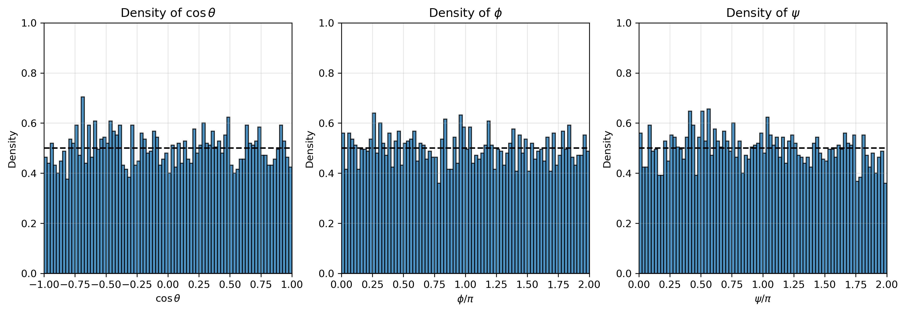

# rotate_adsorbate.py

A Python tool to generate rotated configurations of a molecule or protein using Euler angles. It supports both grid-based and random sampling and saves the rotated coordinates together with the corresponding angles. This tool is useful for molecular simulations, protein orientation studies, and sampling in 3D rotational space.

---

## Requirements

- Python ≥ 3.8  
- Dependencies:
  - `numpy`  
  - `scipy` (`scipy.spatial.transform.Rotation`)  
  - `matplotlib`  
- Standard libraries: `math`, `argparse`, `sys`, `os`

---

## Inputs and Outputs

### Inputs
- **XYZ file**: molecular structure to be rotated (e.g., coarse-grained protein).  
- **Mode**:
  - `grid` → sampling using midpoints (open intervals)  
  - `random` → Haar-like random sampling
- **Parameters**:  
  - For `grid`: number of divisions (`ntheta`, `nphi`, `npsi`)  
  - For `random`: total number of rotations (`nrot`)

### Outputs
- **Files**:  
  - Rotated configurations in an XYZ trajectory file
  - `data.dat` containing the Euler angles ($\theta$, $\phi$, $\psi$)  
- **Figures**:  
  - Angle distributions ($\theta$, $\phi$, $\psi$)  
  - Orientation sampling on the unit sphere  

---

## Uniform sampling of 3D rotations

Here, we justify the range of the angle in order to sample rotation of protein.

The rotation of a protein (or any molecule) can be expressed as the orientation of a unit vector $\hat r$. In spherical coordinates, this vector is defined by the polar angle $\theta$ and the azimuthal angle $\phi$ so:

$$
\hat r = \left(\sin\theta \cos\phi , \sin\theta \sin\phi , \cos\theta \right) ;
\qquad 0 \leq \theta \leq \pi , 0 \leq \phi < 2\pi
$$

The corresponding surface element on the unit sphere is:

$$
dS = \sin\theta d\theta d\phi
$$

Integrating this surface element over the full ranges of $\theta$ and $\phi$ covers the entire sphere, which corresponds to sampling all possible orientations:

$$
S = \int_{0}^{\pi} \int_{0}^{2\pi} \sin\theta d\theta d\phi
$$

Using the relationship $-d\left( \cos\theta \right) = \sin\theta d\theta$ and inverting the range of integration (from $\pi$ to $0$), we obtain the following expression:

$$
S = \int_{-1}^{1} \int_{0}^{2\pi} d\left(\cos\theta\right) d\phi
$$

This formulation shows that uniform sampling in $\cos\theta$ and $\phi$ is required to generate an unbiased distribution of orientations. To account for rotations around $\hat r$, a third angle $\psi$ is introduced with range $0 \leq \psi < 2\pi$.

Therefore, the theoretical range to sample rotations in 3D is:

$$
\begin{aligned}
\cos \theta &\in [-1, 1] \\
\phi &\in [0, 2\pi] \\
\psi &\in [0, 2\pi]
\end{aligned}
$$

---

### Random Sampling
Using `rng.random() ∈ [0,1)`, the mapped ranges are:

$$
\cos \theta \in [-1, 1), \quad
\phi \in [0, 2\pi), \quad
\psi \in [0, 2\pi)
$$

- Values at the upper bound are excluded (no repetition with 0).  
- Ensures isotropic and unbiased orientation sampling.

### Grid Sampling
Midpoints of open intervals:

$$
\cos \theta \in (-1, 1), \quad
\phi \in (0, 2\pi), \quad
\psi \in (0, 2\pi)
$$

This avoids duplication at the edges while covering the full space.

---

## Quick Start

Run the script for random mode:

`python3 rotate_adsorbate.py protein.xyz -mode random -nrot 1000`

or, for grid mode:

`python3 rotate_adsorbate.py protein.xyz -mode grid -ntheta 10 -nphi 20 -npsi 20`

## Example Results

### Random vs. Grid Sampling

Both methods cover orientations uniformly, but grid produces structured sampling while random achieves isotropy.

   

**Figure 1.** Sampling of rotation on the unit sphere using two schemes: (A) random sampling with $n_{\text{rot}} = 1000$, and (B) grid sampling with $n_{\text{rot}} = 4000$ ($n_{\theta}$ = 10, $n_{\phi}$ = 20, $n_{\psi}$ = 20).

---

### Angle Distributions

The script also generates 2D plots of the Euler angles, showing the extent and distribution of the applied rotations.  
Below is an example for grid sampling with $n_{\theta} = 20,\; n_{\phi} = 10,\; n_{\psi} = 10$.

**Figure 2.** Distribution of Euler angles for grid sampling $n_{\text{rot}} = 4000$ ($n_{\theta}$ = 10, $n_{\phi}$ = 20, $n_{\psi}$ = 20).

---

## Optional: Histogram Analysis

Using the auxiliary script `plot_histos.py`, the Euler angles can be recalculated from the rotated XYZ file. This allows verifying whether the generated sampling covers the expected ranges uniformly.

Run the script as:

`python3 plot_histos.py 4F5S_nrot-1000_random.xyz -n1 128 -n2 363 -n3 200`

- `-n1`, `-n2`, `-n3` are the atom (or residues) indices (1-based) used to define the reference vectors for angle calculation.  
- The script produces the file `histos_angles_1x3.png`, which contains histograms for $\cos\theta$, $\phi$, and $\psi$.

**Figure 4.** Histograms of the Euler angles ($\theta$, $\phi$, $\psi$) obtained from the rotated protein configurations. A nearly flat distribution (close to 0.5) indicates unbiased and uniform coverage of the rotational space.

## References

- Kuffner, J. J. (2004). *Effective sampling and distance metrics for 3D rigid body path planning*.  
  [https://doi.org/10.1109/ROBOT.2004.1302402](https://doi.org/10.1109/ROBOT.2004.1302402)

- Shoemake, K. (1992). *Uniform random rotations*. In *Graphics Gems III*, 124–132.  
  [https://doi.org/10.1016/B978-0-08-050755-2.50034-1](https://doi.org/10.1016/B978-0-08-050755-2.50034-1)

